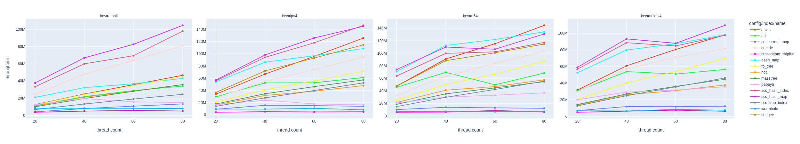
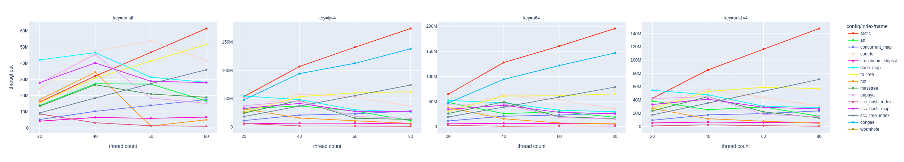
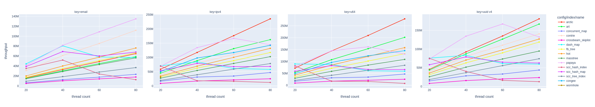
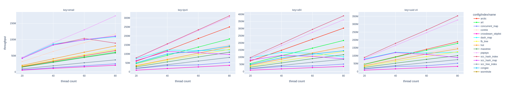
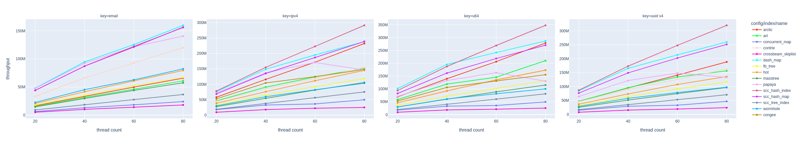
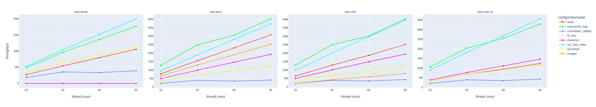
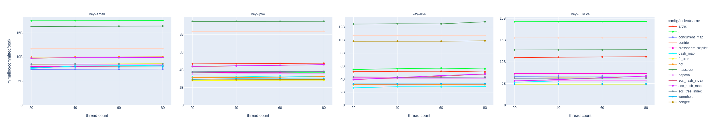

# arctic

[](https://crates.io/crates/arctic-map)
[](https://docs.rs/arctic-map/latest/arctic)

This is the original implementation of
[Arctic: a practical lock-free adaptive radix tree](https://www.usenix.org/conference/osdi26/presentation/ni).

The main data structure is `ConcurrentMap`,
which is a thread-safe [map](https://en.wikipedia.org/wiki/Associative_array) that provides
[lock-free](https://en.wikipedia.org/wiki/Non-blocking_algorithm#Lock-freedom),
[linearizable](https://en.wikipedia.org/wiki/Linearizability)
writes (e.g., `upsert`, `remove`);
[wait-free](https://en.wikipedia.org/wiki/Non-blocking_algorithm#Wait-freedom),
linearizable reads (i.e., `get`);
and wait-free, **non-linearizable** scans
over key ranges and prefixes, in sorted order.

This crate also includes `SequentialMap`, which shares
the same underlying structure as `ConcurrentMap`, but
gives up thread safety in exchange for single threaded performance
and a more convenient API. The borrow checker allows us to
safely take advantage of both APIs at runtime, via `ConcurrentMap::as_sequential`.

## Examples

```rust
use std::thread;

use arctic::ConcurrentMap;
use arctic::Order;

let map = ConcurrentMap::<u64, u64>::default();

thread::scope(|scope| {
    let map = &map;

    // Concurrent writers (with overlapping keys)
    for thread in 0..8 {
        scope.spawn(move || {
            for offset in 0..128 {
                // 0..128, 64..192, ..., 448..576
                map.upsert(thread * 64 + offset, thread);
            }
        });
    }
});

// Ordered iteration over ranges
assert!(
    map.range(5..=102)
        .entries(Order::Ascend)
        .map(|(key, _)| key)
        .eq(5..=102)
);

// Ordered iteration over prefixes
assert!(
    map.prefix(&[0, 0, 0, 0, 0, 0, 2])
        .entries(Order::Descend)
        .map(|(key, _)| key)
        .eq((512..576).rev())
);
```

## Why use this crate?

As far as we know (corrections welcome!), out of all map data structures that (a) are lock-free
and (b) support ordered scan operations, `ConcurrentMap` provides the highest scalability and throughput.
In fact, under various conditions (integer keys, skewed requests, update-heavy),
we even out-perform data structures without properties (a) and/or (b).
Our benchmarking infrastructure is in [this repository](https://github.com/nwtnni/index-bench);
users are encouraged to measure performance on their own workloads.

Briefly comparing against some alternative data structures:

- Concurrent hash maps (e.g., [DashMap](https://github.com/xacrimon/dashmap), [papaya](https://github.com/ibraheemdev/papaya))
  have excellent performance, but do not support scan operations.
- Concurrent B+-trees (e.g., [scc::TreeIndex](https://codeberg.org/wvwwvwwv/scalable-concurrent-containers))
  have good performance, but are typically not lock-free.
- Concurrent skiplists (e.g., [crossbeam_skiplist](https://github.com/crossbeam-rs/crossbeam/tree/main/crossbeam-skiplist))
  have poor performance on modern hardware (low cache locality),
  although there are lock-free implementations.

## Limitations

- 128-bit atomic support required for good performance (currently using [portable-atomic](https://github.com/taiki-e/portable-atomic) crate), and atomic 128-bit compare-and-swap required for lock-freedom.
- Currently tested only on x86-64, but should work on other architectures in theory.

## Correctness

The research paper presents sketch proofs of linearizability and lock-freedom.

More practically, we employ property testing (via [proptest](https://docs.rs/proptest/latest/proptest/))
to test edges, node headers, and SIMD algorithms. The `state_machine` test suite uses
[proptest-state-machine](https://proptest-rs.github.io/proptest/proptest/state-machine.html)
to ensure `ConcurrentMap` and `SequentialMap` match `BTreeMap`
on arbitrary sequences of operations.

The `random` test suite inserts and removes disjoint sets of keys on each thread.
The `orthogonal` test suite is a WIP attempt to build a concurrent version of the
`state_machine` test. There is some preliminary work on writing
[shuttle](https://github.com/awslabs/shuttle)-based tests.

The entire test suite can be run with `cargo test --release --features proptest,rand,validate`.

## Benchmarks

Here are some [YCSB workload](https://github.com/brianfrankcooper/YCSB/wiki/Core-Workloads)
scalability results, measured and plotted using [index-bench](https://github.com/nwtnni/index-bench).
We insert 100M random keys of different types with u64 values,
and then (for non-load workloads) record the throughput of 100M operations,
using the default Zipfian skewness of 0.99 (top 10 keys receive ~17% of requests).

These were run on a [Chameleon](https://www.chameleoncloud.org/)
compute_icelake_r650 instance ([example](https://www.chameleoncloud.org/hardware/node/sites/tacc/clusters/chameleon/nodes/dde004bf-b99b-4c0a-b2d4-d5537378626a/)) with 80 physical cores.
For reproducibility, we pin threads to cores, interleave memory across NUMA sockets,
disable hyper-threading and turbo-boost, and set the CPU scaling governor to performance.

As for baselines,
[art](https://dl.acm.org/doi/10.1109/ICDE.2013.6544812)
(using [ROWEX](https://dl.acm.org/doi/10.1145/2933349.2933352)),
[fb_tree](https://dl.acm.org/doi/10.14778/3725688.3725691),
[hot](https://dl.acm.org/doi/10.1145/3183713.3196896),
and [wormhole](https://dl.acm.org/doi/10.1145/3302424.3303955)
are research systems written in C/C++ and integrated (hackily)
via [cxx](https://github.com/dtolnay/cxx). The remainder
are published Rust crates (including masstree, which is the
[Rust port](https://github.com/consistent-milk12/masstree)
rather than the [original](https://github.com/kohler/masstree-beta)).

### YCSB-Load (100% insert)



### YCSB-A (50% read, 50% update)



### YCSB-B (95% read, 5% update)



### YCSB-C (100% read)



### YCSB-D (95% read, 5% insert, skewed toward latest)



### YCSB-E (95% scan, 5% insert)



### YCSB-Load (100% insert) peak memory usage



## Feature flags

**Public features**.
- `smr-hazard`, `smr-epoch`, and `smr-seize` enable their
  respective safe memory reclamation (`Smr`) backends. At least
  one SMR backend is required to use `ConcurrentMap`; by
  default, seize is enabled and used.

**Development features**. These have no stability guarantees.

- `validate` enables runtime checks of local invariants.
- `stat` enables runtime statistic gathering.
- `opt-no-*` disable optimizations for ablation measurements.
- `opt-membarrier` enables [`membarrier`](https://man7.org/linux/man-pages/man2/membarrier.2.html)
  for hazard key and seize SMR backends.
- `rand` enables integration with [rand](https://docs.rs/rand/latest/rand/)
- `shuttle` enables integration with the [shuttle](https://docs.rs/shuttle/latest/shuttle/)
  concurrency testing runtime.
- `proptest` enables integration with the [proptest](https://docs.rs/proptest/latest/proptest/)
  property testing framework.

## License

Licensed under either of

 * Apache License, Version 2.0
   ([LICENSE-APACHE](LICENSE-APACHE) or <http://www.apache.org/licenses/LICENSE-2.0>)
 * MIT license
   ([LICENSE-MIT](LICENSE-MIT) or <http://opensource.org/licenses/MIT>)

at your option.

## Contribution

Unless you explicitly state otherwise, any contribution intentionally submitted
for inclusion in the work by you, as defined in the Apache-2.0 license, shall be
dual licensed as above, without any additional terms or conditions.
